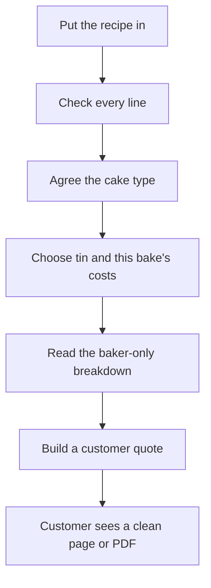

# Bakers Price — full picture of the app

This file is the memory of the product. If you are an AI (or a person) new to this project, read this first. It explains what the app is for, how a baker uses it, what the customer is allowed to see, and how the pieces fit together. Everyday words are used on purpose. File names and commands come later, for when you need to change or run the code.

For install, env vars, and deploy commands, see [README.md](README.md).

**In one sentence:** Bakers Price takes a home baker’s cake recipe, turns it into a sized and priced bake, and produces a clean quote the customer can open — without ever showing costs, margins, or the baker’s workings.

---

## What this app is

Bakers Price is a tool for **one baker** (or one bakery account) who needs to:

1. Take a recipe written any which way (cups, grams, “3 large eggs”).
2. Understand what kind of cake it is.
3. Scale it to a real tin.
4. Work out a fair selling price.
5. Send the customer a simple quote or price list.

It is **not** a shop, not a stock system, and not a social app. There is no dashboard of charts. The home screen is **Recipes**.

The personality of the screens is a calm bakery workshop: cream paper, terracotta buttons, quiet type. That look is intentional. Do not turn it into a generic blue office product, and do not make it cute-cupcake.

---

## Who uses it

**The baker** signs in (or tries the flow without an account) and sees everything: costs, maths, warnings, three price levels.

**The customer** only ever opens a special link or a PDF. They see the cake name, size, approximate weight, the price, allergens, and any note the baker chose to share. They never see ingredient costs, hourly rate, overhead, or “how we got this number.”

**A visitor who is not signed in** can still start a new recipe by hand, walk through the calculation, and look at the shared ingredient list. They cannot save recipes, save quotes, change prices, or use photo/PDF reading of a recipe card.

---

## The journey, start to finish

Imagine Nana’s lemon drizzle. The baker wants to sell an 8-inch round.

1. **Put the recipe in** — paste it, photograph the card, or type the lines.
2. **Check every ingredient** — the app never silently invents a weight. If it does not know an ingredient, the baker must type grams.
3. **Agree the cake type** — sponge, butter cake, carrot cake, and so on. This chooses how full the tin should be and how much moisture the cake loses in the oven. The baker can override the guess.
4. **Choose the tin and this bake’s costs** — shape and size, plus labour minutes, energy, packaging, overhead, and the three profit levels.
5. **Read the breakdown** — how much batter, baked weight, scaled ingredients, cost, three selling prices, and a self-check. Every number is labelled so the baker knows if it was typed, calculated, or only estimated.
6. **Build the customer quote** — one size, or a small price list of sizes. Copy a link. Download a PDF.

That is the whole product. The other pages (ingredient prices, cost defaults, saved quotes) support this path.

---

## What each screen is for

The baker’s bar at the top has four places, plus Log in / Log out. On a phone the same four sit behind the menu button. There is no bottom tab bar.

### Recipes (home)

“Your cakes, ready to scale and quote.”

Lists cakes saved to **this account**. New recipe starts the walkthrough. Opening a saved cake jumps back in at the ingredient check. Delete asks first, because calibrations (real-bake yield) go with the recipe.

If you are not signed in: you still see **New recipe**, plus a calm note that saved cakes live on an account.

### Quotes

Every quote and price list this baker has built. Open the customer page, download the PDF, or delete (with a confirm). Empty state: finish a recipe through the breakdown, then build a quote.

### Ingredients

A shared catalogue used to recognise names (“plain flour”, “caster sugar”), convert cups or whole eggs into grams, and look up a default shop price (Aldi is the starting basis).

The baker can search, change a price, add an ingredient, or paste a bulk price list (`name, unit, price` one line at a time). Everyone can **read** the list. Only the site admin can **change** it, so no one else — signed in or not — can overwrite everyone’s prices.

A price you type on one recipe does **not** change this catalogue unless you later press “push to the master list” on the breakdown.

### Cost defaults

Starting numbers for every bake: business name on documents, hourly rate, typical minutes, energy, packaging, overhead %, and three margin levels (minimum / standard / premium, starting at 28 / 50 / 65).

The hourly rate is **asked, never guessed**. Until it is set, labour is treated as £0 and prices cannot honestly be called final.

Guests can see the template. Saving your own numbers needs an account.

### Log in / Create an account

Email and password (at least 8 characters). Optional Google button if that is switched on for this install. You can show the password while typing. The browser is allowed to offer “save this login.” The app itself never stores the password in the browser as readable text.

### The customer page (`/q/…`)

No baker menu. Looks like a printed quotation or a cake price list. Invalid or missing links say the quote is unavailable, calmly, with no baker chrome.

---

## The six steps in detail

### 1. Recipe

Three ways in:

- **Paste** any mix of grams, cups, and “3 eggs.”
- **Upload a photo or PDF** of the card. That is sent to a writing helper (Claude) to transcribe. You still confirm every line. This needs a signed-in baker **and** an API key on the server. If the key is missing, the screen says auto-reading is off and you should enter by hand. The rest of the app still works.
- **Enter manually** — blank rows you fill yourself. Always available, no key, no account.

### 2. Confirm weights

The original wording of the recipe is kept. Grams are **added beside** it, not swapped in as if the baker wrote grams.

- A line already in grams stays a weight.
- A cup uses **that ingredient’s** density from the catalogue, not a one-size-fits-all cup.
- Eggs, bananas, and similar stay a **count**. The app also shows an estimated gram range for the maths (for example six bananas ≈ 600–720 g).
- If the baker types an override in grams, that always wins.

Flagged rows (unknown name, or no weight yet) must be fixed before save or continue. “Re-check weights” re-runs the matching without calling the writing helper.

Also on this step: recipe name, allergen text (shown to customers if filled), and baker-only notes (never shown to customers).

You can save (needs login) or **continue without saving**.

### 3. Cake type

The app looks at fat, sugar, egg, liquid, and cocoa against the dry base (flour, and oats when they act like structure). It scores these types:

- Genoise / sponge  
- Chiffon  
- Butter cake  
- Pound cake  
- Oil-based / quick bread  
- Chocolate cake  
- High-hydration fruit / oat loaf  
- Carrot cake  
- Red velvet  
- No strong match  

You see confidence, why it chose that type, and a dropdown to override. The type drives how full the tin should be and how much weight is lost in the oven. If there is no strong match, pick the intended type yourself.

### 4. Pan and this bake’s costs

**Shapes:** round, square, rectangular, loaf, bundt. **Units:** inches or centimetres.

What you must type:

- Round or bundt: diameter (depth optional).  
- Square: side (depth optional).  
- Rectangular: length and width (depth optional).  
- Loaf: length is enough; missing width is taken as half the length, missing depth as 0.3 × length, and the screen says so.

If depth is left blank, a typical depth is assumed (about 3 inches for round/square/bundt, 2 inches for rectangular).

**Deep / bundt** forces a 55–65% fill, whatever the cake type.

**Calibration (optional, gold standard):** after a real bake, enter the tins you used and the batter you actually made, in grams. The app works out this recipe’s true “grams of batter per millilitre of tin.” Save that as the recipe default (needs a saved recipe and login). Then you can use that yield instead of the generic fill table.

There is also a hidden-feeling “advanced” fill % if you already know it.

Then **this bake’s costs** (labour minutes, hourly rate, energy, packaging, overhead, three margins). These start from your defaults and can be changed for this bake only. Labour, energy, and packaging are **flat for the bake** — a bigger cake does not multiply the electricity bill in this app.

**Calculate** stays off until required tin sizes are in.

### 5. Breakdown (baker only)

This is the working sheet. Customers never see it.

You get:

- Tin volume, fill level, batter weight, scaling factor from the master recipe, baked weight — each with a trust label.  
- Scaled ingredient list. Weight lines scale by grams. Count lines scale to a **whole number** of eggs/bananas/etc., with a note if rounding is awkward.  
- Ingredient prices from the catalogue, with optional **this-recipe-only** overrides. You can apply, save on the recipe, or push into the shared catalogue.  
- Cost build-up and three selling prices (minimum, standard, premium).  
- A self-audit (sensible density, not scaling wildly, and so on).  
- If prices are incomplete: a clear **estimate** banner, not a fake firm price.

You can add this size to a **price-list menu** (for example “8-inch round, serves 12”) and run the tin step again for another size. Then **Build customer quote**.

Safe scaling is treated as about **a quarter to four times** the master recipe. Outside that, the app says you should trial-bake before relying on the number commercially.

### 6. Customer quote

Choose:

- **Single quote** — one size, one of the three price levels.  
- **Price-list menu** — the sizes you added on the breakdown.

Fill cake name, business name, customer-facing description, allergens, and a personal note. Generate. You get a public link and a PDF. The page and the PDF are built from an allowed list of fields only. Cost and margin are not in that list, so they cannot leak by accident.

If some ingredient prices were missing, the quote is an **estimate**. The customer sees a plain sentence: the price is estimated and confirmed when they order. They still do not see the cost sheet.

---

## How to read the trust labels

Every figure the baker sees is tagged. The weakest tag in a chain wins (one shaky input makes the result shaky).

| Label on screen | Plain meaning |
|-----------------|---------------|
| **KNOWN** | You typed this. |
| **CALCULATED** | Straight sums from known or calculated numbers. No table of typical cakes. |
| **ESTIMATED** | Taken from the app’s generic tables (typical fill, moisture, density). Check with a real bake. |
| **REQUIRES TESTING** | Do not sell on this number until a real bake confirms it. |

Missing hourly rate, missing ingredient prices, or a wild scale-up can push things into estimate / requires testing. That is the product being honest, not a bug.

---

## How money is worked out (baker side)

- **Ingredients** scale with cake size. Count items are priced per each when the catalogue says so; everything else is turned into a price per gram.  
- **Labour, energy, packaging** are a lump for this bake.  
- **Overhead %** is added on top of that total.  
- **Selling price** at each level is: cost-plus-overhead divided so that the chosen margin (28%, 50%, 65% by default) is left in the price.

If some ingredients have no price:

- A **firm floor** pretends the missing ones cost £0 (too low, but honest as a floor).  
- An **estimate** guesses the missing weight using the average price of the ingredients that *are* priced.  
- The quote is marked as an estimate.

The customer still only sees one price (or a small list of sizes), never this split.

---

## Accounts, saving, and the hosted demo

- Passwords are stored on the server as a one-way scramble, not as the typed password.  
- Staying logged in uses a 30-day session cookie the browser cannot read as a password.  
- First person to sign up on a brand-new empty database is given any leftover sample recipe that had no owner. Later accounts are not.  
- On **this computer**, recipes and logins live in a file on disk and survive restart.  
- On the **free hosted demo** (Render), the disk is wiped when the site sleeps (~15 minutes idle) or when it is redeployed. Accounts vanish. Login then fails; creating the account again works. Login and signup show a short warning there. That is hosting, not a forgotten password field.

Google sign-in is optional. If someone already has an email-and-password account, they must log in with the password before Google can be linked to that same email.

---

## Rules the app must not break

These are product promises. Changing them is a product decision, not a styling tweak.

1. **Never invent a missing ingredient weight.** Flag it. Wait for grams.  
2. **Keep the original measurement.** Do not rewrite “2 cups” as if the baker wrote grams.  
3. **Customer documents never include cost, margin, overhead, or baker notes.**  
4. **Labour, energy, and packaging do not grow with tin size.**  
5. **Hourly rate is never assumed.**  
6. **The shared ingredient list is readable by everyone; only the one admin account may edit prices.**  
7. **Photo/PDF/paste auto-reading spends paid API credits** — only signed-in bakers, and only if the server has a key.  
8. **Recipes, quotes, and personal cost defaults belong to the signed-in account.** The server ignores any “user id” the browser tries to send.  
9. **There is no extra dashboard, no bottom navigation, no dark mode in the current design.** Recipes is home.

---

## What you can do without an account

Walk the recipe by hand, check weights, pick a cake type, enter a tin, see a breakdown. Look at ingredients and default cost numbers. Open a customer link someone already created.

You cannot save the recipe, save the quote, change catalogue prices, save defaults, save a real-bake calibration onto a recipe, or use auto-reading of a card.

Unfinished wizard work is remembered in the tab for a while so a refresh does not wipe the paste. After you log in to save, you may need to save the recipe and calculate again before a quote can be stored.

---

## Sample data

If you run the seed on an empty database with no users, you get **Banana & oat loaf**: mixed counts, cups, and grams, with a short allergen line. It is stored with no owner until the first signup claims it. The ingredient catalogue is filled from a large starting list (Aldi-based prices where provided). Later seeds do not overwrite a database that already has cakes or users.

---

## Folder map (for someone changing the code)

Two halves in one project: screens in `client/`, maths and saving in `server/`.

**What the baker clicks**

| Place | Role |
|-------|------|
| `client/src/App.jsx` | Menu and which screen each address opens. Customer quotes skip the baker menu. |
| `client/src/wizard/Wizard.jsx` | The six-step walkthrough. |
| `client/src/pages/` | Recipes, quotes, ingredients, defaults, login, signup, customer page. |
| `client/src/auth.jsx` | Who is signed in; guest messages. |
| `client/src/components.jsx` | Shared pieces: page title, empty state, money, trust badges, password field. |
| `client/src/styles.css` | Colours, type, phone layout. |
| `client/src/icons.jsx` | Small drawings used in the menu and empty states — no extra icon library. |

**What the server does**

| Place | Role |
|-------|------|
| `server/index.js` | Starts the server, cookies, routes. |
| `server/db.js` | The on-disk database file and tables. |
| `server/lib/measure.js` | Turns a recipe line into grams or a count without throwing away how it was written. |
| `server/lib/classify.js` | Guesses cake type from ratios. |
| `server/lib/calcEngine.js` | Tin volume, fill, scale, baked weight. |
| `server/lib/cost.js` | Costs and the three selling prices. |
| `server/lib/audit.js` | Self-check after a calculation. |
| `server/lib/accuracy.js` | The four trust labels. |
| `server/lib/auth.js` | Accounts, sessions, “this cake belongs to this baker.” |
| `server/lib/masterIngredients.js` | Shared ingredient list and prices. |
| `server/lib/quotePdf.js` | Customer PDF from the same allowed fields as the public page. |
| `server/anthropic.js` | Optional card reading. |
| `server/routes/` | One file per door: login, parse, recipes, ingredients, defaults, tins/calibration, calculate, quotes. |

The public customer fetch and the PDF are built on the server from a **whitelist**. If you add a field to a quote, do not put cost or margin on that list.

---

## If you are an AI about to change something

- Prefer matching the existing screens and promises above.  
- Do not add a second navigation style, metric cards on the home page, or customer-visible costs.  
- Do not store passwords in the browser.  
- Do not treat “the baker owns this cake” as a check the browser can be trusted to send — the server must use the signed-in session.  
- UI changes should be tried in the browser the way a baker would click, not only as a screenshot.  
- If the change is only visual, keep the six steps and the maths the same.

That is the whole app: a careful path from a messy recipe to an honest baker worksheet to a quiet customer quote.
